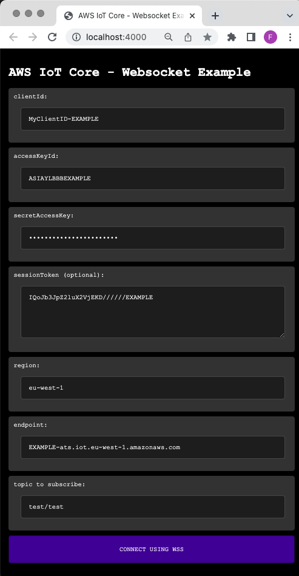
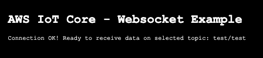
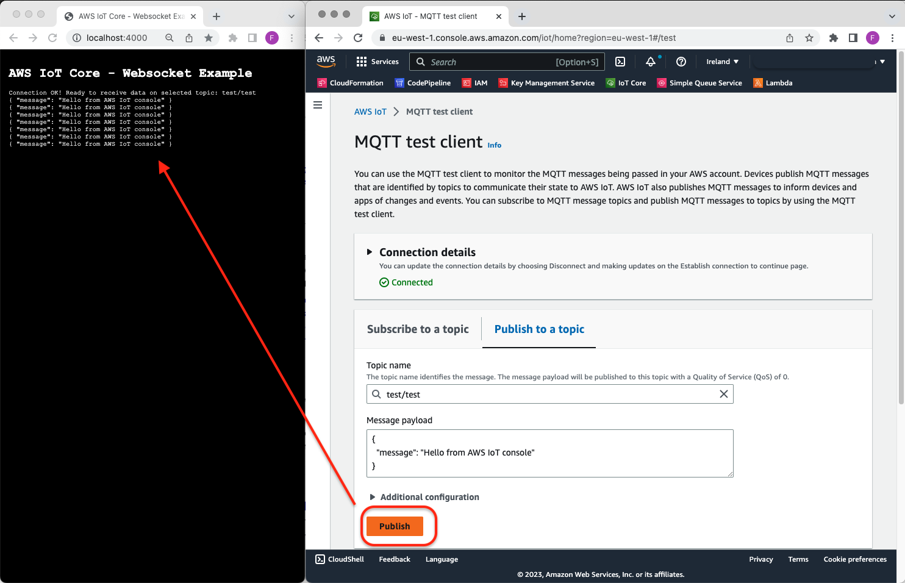
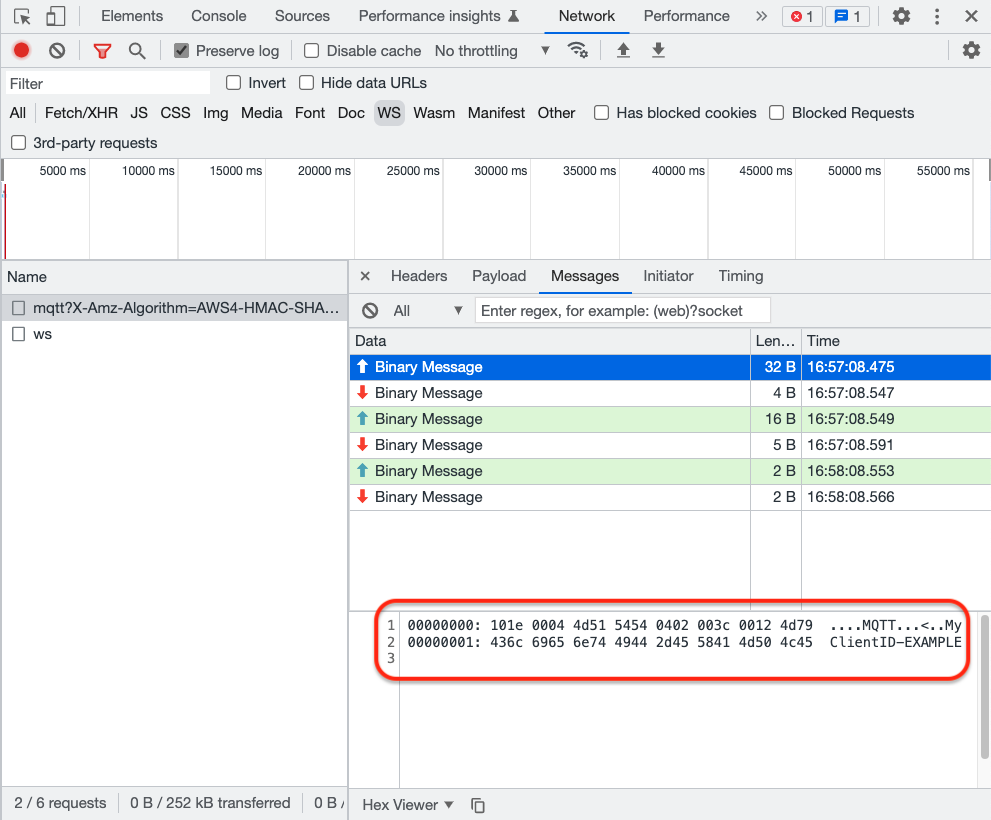

# Connecting to AWS IoT Core from a browser using MQTT via WSS

## Background 

AWS IoT Core supports clients that use the MQTT over WebSocket Secure (WSS) protocols to publish and subscribe to messages. The service supports AWS Signature Version 4 (AWS SigV4) or Custom Authentication to authenticate clients.

# Connecting to AWS IoT using a standard browser

MQTT over Websockets enables a standard browser to send and receive messages in real-time with AWS IoT Core. 

This project is a minimal example of how to build a the SigV4 Websockets URL. And then using it to connect to AWS IoT core using a standard MQTT client.

The project comes with a simple GUI to make it easy to enter your own credentials. 

Important note: Credentials used in this example are processed locally and do not leave the browser. 

# Requirements

-	AWS Account
-	AWS IoT Core Endpoint
-	AWS IAM User or Temporary Credentials from STS with enough privileges to interact with AWS IoT Core
-	Node.js

# How to use


```bash

git clone https://github.com/aws-samples/aws-iot-wss-ts-client

cd aws-iot-wss-ts-client/web

npm install

npm run serve

```

A browser window should pop-up. Populate the form with your details and press the connect button.

- clientId: any client indetifier (i.e. MyCleint-ABCD)
- accessKeyId: your IAM or STS access Key ID
- secretAccessKey: your IAM or STS secret key
- sessionToken: if you are using STS, your session token
- region: the region you are going to connect to (needed to calculate the SigV4 signature)
- endpoint: your IoT Core endpoint
- topic: the topic you would like to subscribe to



If connected successfully, you should now try sending messages to the topic you chose to subscribe to. 



The messages will appear in the browser window in real-time.



You can also take a look at the browser's development tools to inspect the MQTT packets.




# Cleanup

There are no services that need to torn down. However, you can save some space by removing all the files created by running  ```npm run clean```

